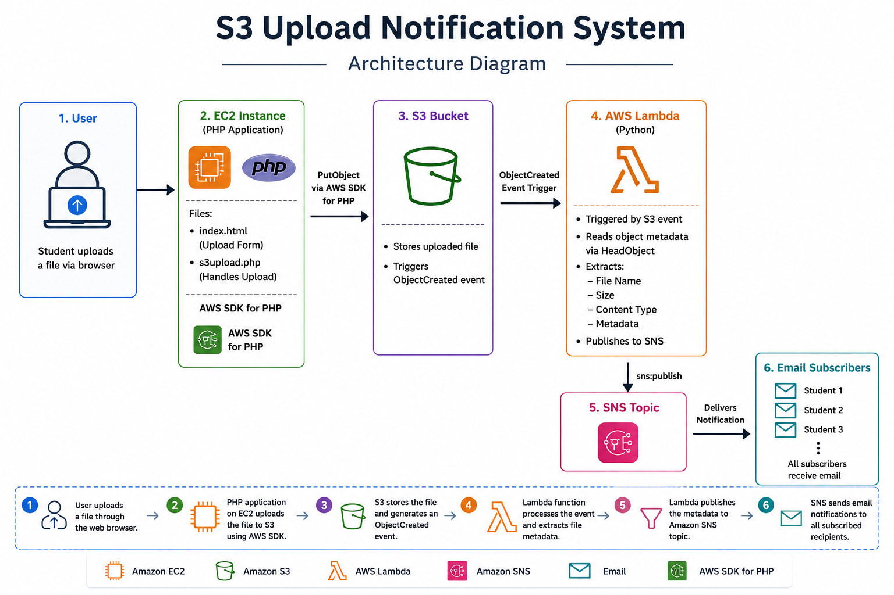

# AWS-S3-Upload-Notification-System
An event-driven AWS project that automatically sends email notifications when files are uploaded to Amazon S3 using EC2 (PHP), AWS Lambda (Python), Amazon SNS, and IAM.

  

  
   
  <em>Upload Notification System Architecture</em>

